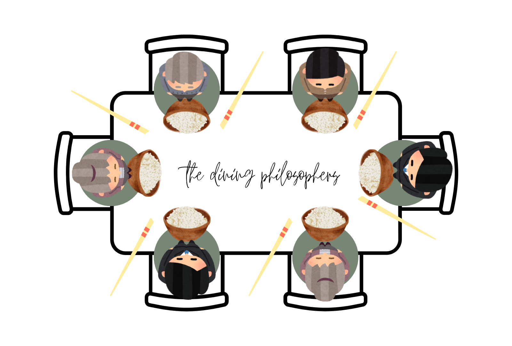

# The Dining Philosophers Problem

**By Abraham Montalvo and Abigail Brown**
 
Group Project for CS-410

## High Level Description

The Dining Philosopher's Problem states that there are _k_ philosophers seated around a table. These philosophers live
out their life in happy thought. However, they occasionally get hungry. In order to eat the rice set in front of them,
they must have 2 chopsticks available to use: one on their left and one on their right. However, for every _k_
philosopher, there is only 1 chopstick. This means that the philosophers must share their chopsticks with their
neighbors. This can thus result in a deadlock situation, where one hungry philosopher never relinquishes their chopstick
to their neighbor, or even starvation, where the philosophers are unable to ever eat and thus are starved.

The goal of this project is to develop a coded solution that will solve potential deadlock and starvation scenarios. The
following code best provides a solution to the infamous dining philosopher problem.

## Overview of the Code

## Resources Used
